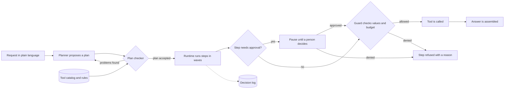
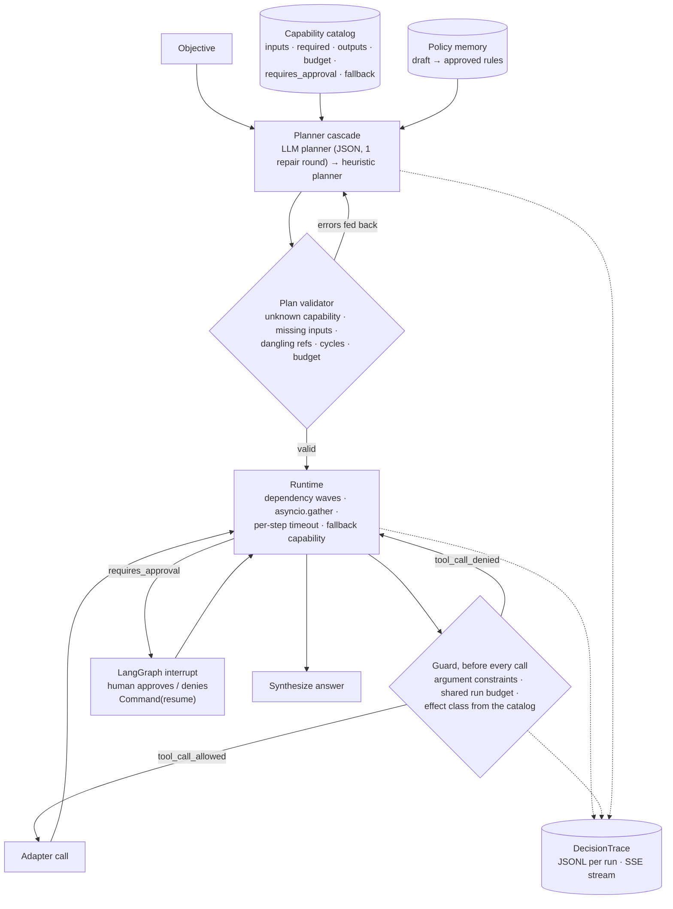

# governed-agent-orchestrator

**A capability catalog with typed contracts, a plan validator, an LLM-then-heuristic planner cascade, parallel-wave execution with fallbacks, bounded tool execution (argument constraints, a shared per-run call budget, effect classes), a DecisionTrace journal that records every allowed and denied call, governed policy memory, and a LangGraph runtime that interrupts for human approval. Exposed over FastAPI with Server-Sent Events.**

  [](https://github.com/gandhiashutosh14/governed-agent-orchestrator/actions/workflows/ci.yml) 

---

> **In plain English:** Companies want artificial intelligence (AI) agents to do real work, such as querying sales data or emailing a report. Before they allow that, they need guarantees that an agent cannot exceed its authority, overspend, or do something irreversible without a person saying yes. This repository is a working prototype of that control layer, tested on a public sample database of a music store (Chinook).
>
> **Reading guide:** business readers can read the next three sections, then jump to [SWOT](#swot-analysis) and [where this applies](#where-this-applies). Engineers can go straight to [Architecture](#architecture).

## The problem in plain English

A finance team asks an AI agent: "Forecast next year's revenue and send it to finance@example.com." An AI agent is software in which a large language model (LLM) decides which tools to call, and with what values. Here it must look up sales, run a forecast, write a summary and send an email. The first three steps only read data. The last one leaves the company and cannot be taken back.

In a typical tool-using agent, the model chooses the tools and fills in the values itself. A misread request, an invented email address or a hostile instruction hidden in a document can then become a real action. Telling the model to "be careful" in its prompt is not a control, because nothing forces the model to comply.

This project moves the rules out of the prompt and into the software around the model. An operator lists every tool in a catalog, with the values it accepts, a time limit and how serious its side effect is. The model may only propose a plan. The runtime (the code that carries the plan out) checks that plan, counts every tool call against a budget, and pauses before any step that needs approval. It also records every decision, including every refusal.

Railway signalling solved a similar problem long ago. In a traditional signal box the levers are interlocked, so the machinery refuses unsafe combinations whatever the signaller intends. The guard in this project plays the same part for an agent's tool calls.

<p align="center"></p>
<p align="center"><sub>Image: <a href="https://commons.wikimedia.org/wiki/File:Cattal_Signal_box_-_geograph.org.uk_-_1586758.jpg">Cattal Signal box</a> by Alan Murray-Rust, <a href="https://creativecommons.org/licenses/by-sa/2.0/">CC BY-SA 2.0</a>, via Wikimedia Commons.</sub></p>

## Executive summary

| Question | Answer |
|---|---|
| What problem does this address? | Letting an AI agent take real actions without letting it exceed its authority, make unlimited tool calls, or do something irreversible without human approval. |
| Who has this problem? | Heads of AI, platform engineers, security and risk teams, and business owners in organisations that connect LLM agents to internal data or to outside systems such as email. |
| What does this repository do? | A control layer sits between the model and its tools. It has a tool catalog with allowed values, a plan checker, a shared call budget, effect classes, an approval pause and a decision log. All of it is served over a web API (application programming interface). |
| What has been shown so far? | 27 automated tests pass with no model involved ([Quick start](#quick-start)). The rule-based planner completed 19 of the 20 audit requests. The other one named no address in an allowed domain, so its plan was refused before any tool ran ([audit report](reports/audit-heuristic.md)). The [guard demo](reports/guard-demo.md) records an approved send, a blocked send, and a budget that let only one of two parallel calls run. |
| How mature is it? | Working prototype on public sample data, run without a language model in the loop. An audit with a small local model (Qwen2.5-Coder-1.5B-Instruct) was started and then stopped, so no model-planner results are claimed ([Measured behaviour](#measured-behaviour)). |
| What it is not | Not a production service. The API has no authentication, checkpoints live in memory, values are not traced to their source, compensations are not executed, and no adversarial or prompt-injection testing was done ([Status and scope](#status-and-scope)). |
| What it would take to use it for real | Real tool adapters behind a reviewed catalog, and authentication and roles on the API. A persistent checkpoint store, such as SQLite or Postgres. An audit with a real model as planner, plus a prompt-injection benchmark. Tracking of where each value came from, and an operator process for running compensations. |

## How it works, end to end



1. **Describe the tools once.** An operator lists every tool in [`capabilities.json`](capabilities.json) with its inputs, allowed values, time limit, effect class and whether a person must approve it. The catalog refuses to load an irreversible tool that skips approval ([`orchestrator/catalog.py`](orchestrator/catalog.py)).
2. **Propose a plan.** If a model is configured, it writes the plan as JSON (a plain-text data format) and gets one chance to repair it. Otherwise, or if that fails, fixed keyword rules produce the plan ([`orchestrator/planner.py`](orchestrator/planner.py), [`orchestrator/heuristics.py`](orchestrator/heuristics.py)).
3. **Check the plan.** The validator lists every problem at once: unknown tools, missing inputs, broken step links, cycles, too many steps, and literal values that break a rule. A plan with any problem never runs ([`orchestrator/plan.py`](orchestrator/plan.py)).
4. **Run in waves.** Steps that do not depend on each other run at the same time. Each step has a time limit and may name a fallback tool to try if it fails ([`orchestrator/runtime.py`](orchestrator/runtime.py)).
5. **Pause for a person.** A step that needs approval stops the run through LangGraph's `interrupt()`. The API reports `awaiting_approval`, and `POST /runs/{id}/approve` resumes or ends the run ([`orchestrator/graph.py`](orchestrator/graph.py), [`orchestrator/api.py`](orchestrator/api.py)).
6. **Guard every call.** Just before a tool runs, the guard checks the values it will actually receive, including values produced by earlier steps. It then takes one unit from the call budget shared by the whole run. A refusal is final for that step: no retry and no fallback ([`orchestrator/guard.py`](orchestrator/guard.py)).
7. **Record everything.** Each decision, including each refusal, becomes a numbered event in the DecisionTrace. Events are saved one per line (JSON Lines) and streamed live as Server-Sent Events (SSE) ([`orchestrator/trace.py`](orchestrator/trace.py)).
8. **Learn only under review.** Fallbacks and rejected plans can be turned into draft planning rules. A draft reaches the planner only after a person approves it ([`orchestrator/policy.py`](orchestrator/policy.py)).

**Worked example.** [`reports/guard-demo.md`](reports/guard-demo.md) runs three scenarios against the same catalog rule: reports may only go to addresses at `example.com`. No language model was involved.

| Scenario | What the decision log shows | Result |
|---|---|---|
| 1. "Forecast next year's revenue and send it to finance@example.com." | Plan: `revenue_by_year` → `forecast_next_year` → `draft_summary` → `send_report`. The three read-only steps ran as calls 1 to 3. The send paused with effect `irreversible`, the demo approved it, and it ran as call 4. | `completed` |
| 2. The same request, sent to `finance@evil-example.org` | The plan checker rejected the plan because the recipient "is not an address in an allowed domain (example.com)". | `failed`, no tool ran |
| 3. Two independent lookups and a summary, with a one-call budget | `s1` used the only call. `s2` and `s3` were denied for budget, and `budget_exhausted` was logged once. Which sibling wins can vary between runs; that only one wins cannot. | `failed`, 1 of 3 steps done |

The forecast in scenario 1 is a straight-line trend over yearly revenue. In the committed audit it predicts 465.22 for 2026 from the 2021 to 2025 totals ([`reports/audit-heuristic.json`](reports/audit-heuristic.json)). The demo's `send_report` writes the report to a local `outbox/` folder; no real email is sent.

## What it is, and why

An agent that can call tools is easy. An agent a business can trust needs a few more things: a contract for every capability it may use, a plan that is validated before anything runs, a hard stop before side effects until a human says yes, a journal of every decision, and rules that only reach the planner after review. This repository implements those pieces over a small, deterministic demo domain (a music store's sales analytics on the public Chinook database) so the behaviour of the orchestration layer can be inspected and tested without a model in the loop.

## Architecture



## Key features

- **Capability catalog as data** ([`capabilities.json`](capabilities.json)): each capability declares inputs, required inputs, outputs, a millisecond budget, whether it needs approval, and a fallback. It is rendered into the planner prompt, so adding an agent is a JSON edit.
- **Exhaustive plan validation**: unknown capabilities, missing required inputs, undeclared inputs, references to unknown steps or outputs, self-references, cycles, step and budget limits, all reported at once so the planner can fix everything in one round.
- **Planner cascade**: an LLM planner (local Hugging Face model or any OpenAI-compatible endpoint) with one repair round, falling back to a deterministic keyword planner. The trace records which planner produced the plan and whether a fallback happened.
- **Wave execution**: steps are grouped into dependency levels and each level runs concurrently; each step is bounded by its capability budget; failures try the declared fallback capability before the run is marked failed.
- **Bounded tool execution** ([`orchestrator/guard.py`](orchestrator/guard.py)): before any adapter is called the runtime checks the resolved arguments against constraints declared in the catalog and reserves one unit of a call budget shared by the whole run. Both outcomes are trace events. See [Bounded tool execution](#bounded-tool-execution).
- **Human approval gate**: `send_report` is the only side-effecting capability and requires approval. The LangGraph node interrupts, the API reports `awaiting_approval` with the steps already completed, and `POST /runs/{id}/approve` resumes via `Command(resume=...)`. Denial ends the run cleanly.
- **DecisionTrace**: 19 event types with monotonic sequence numbers, persisted per run as JSONL and streamed as SSE (`GET /runs/{id}/events` replays history, then follows live).
- **Governed policy memory**: rules are draft by default and are only injected into the planner prompt once approved; a miner turns fallbacks and rejected plans into draft suggestions.

## Bounded tool execution

An agent runtime that can call tools needs to answer three questions before every call: *may this argument value be passed at all*, *has this run already spent what it was given*, and *what kind of side effect is this*. This repository answers them with data in the catalog and a check in the runtime, not with a prompt.

What is enforced, and where:

| Control | Declared in | Enforced by | Trace event |
|---|---|---|---|
| Argument constraints per input (`min`, `max`, `allowed`, `allowed_domains`, `pattern`, `max_length`) | `capabilities.json` → `constraints` | `validate_plan` for literal arguments (a bad plan never runs); `Runtime` again for arguments that resolve from earlier outputs | `plan_rejected` or `tool_call_denied` (reason `constraint`, with the violations spelled out) |
| Shared call budget per run, including fallback calls; `RunBudget.child()` scopes draw from their parent atomically, so two children of a 10-call budget cannot spend 20 between them | `--call-limit N` / `ORCH_CALL_LIMIT` / `Orchestrator(call_limit=)` | `Runtime` reserves one unit under a lock before each call; the count survives the approval interrupt | `tool_call_allowed` (with the budget snapshot), `tool_call_denied` (reason `budget`), `budget_exhausted` (once per run) |
| Effect class `reversible` / `compensable` / `irreversible` with an optional `compensation` capability | `capabilities.json` → `effect`, `compensation` | Catalog load refuses an irreversible capability that does not require approval, a compensable one without a compensation, or a compensation that is not a capability. The plan format has no such field, so a planner cannot relabel a tool | `approval_required` and `tool_call_allowed` carry the effect |

A denial is not a failure to retry: the step fails with the reason, no fallback is tried, and dependants are blocked. The catalog is loaded by the operator and rendered into the planner prompt, so the model sees the constraints but cannot change them.

Demo (deterministic heuristic planner, no model; the report says which revision produced it):

```bash
orchestrator demo-guard --report reports/guard-demo.md
```

[`reports/guard-demo.md`](reports/guard-demo.md) records three scenarios: a report to `finance@example.com` that passes the domain constraint, waits at the irreversible gate, is approved and delivered with every call journaled; the same objective addressed to `finance@evil-example.org`, rejected by the validator before any tool runs; and a scripted plan with two independent steps under a one-call budget, where exactly one sibling runs and the other is denied.

What this is not: there is no taint tracking of values, no delegation to sub-agents (the budget primitive supports child scopes and is tested that way, but the runtime has no sub-plans yet), no compensation is executed automatically (`compensation` is recorded on the trace so an operator or a later runtime can invoke it), and no prompt-injection benchmark was run. The demo proves what the reference monitor does with the arguments it is given; it says nothing about how good a planner is at choosing them.

## Measured behaviour

Audit of the 20 objectives in [`audit/objectives.json`](audit/objectives.json) with the heuristic planner (no model), auto-approving gates, 2026-09-16 ([`reports/audit-heuristic.md`](reports/audit-heuristic.md)):

| Metric | Value |
|---|---|
| Valid plan from the first planner | 19 / 20 |
| Answered | 19 / 20 |
| Approval gates raised | 2 (the objectives that ask to send or email a report to an address) |
| Step fallbacks fired | 0 |
| Median latency | 6 ms |

Before the recipient constraint was added this audit answered 20 / 20 with 3 approval gates. The objective that now fails, "Send the top 5 countries by revenue to the sales director", names no address in an allowed domain, so the validator rejects the plan instead of asking a human to approve a delivery to nobody. The objective was kept as it was so the change is visible.

API smoke test with uvicorn: `POST /runs` for a forecast-and-send objective returned `awaiting_approval` with steps s1..s3 already completed; the SSE endpoint replayed 12 events; `POST /runs/{id}/approve` completed the run with a linear-trend forecast in the answer; a second approve returned 409.

An audit with `Qwen/Qwen2.5-Coder-1.5B-Instruct` as the first planner was started; its first objective produced a plan the validator accepted on the first try, and a later reply with a malformed `inputs` field exposed a parser crash that is now fixed and tested. The run was stopped before completion because of GPU load on the development laptop, so no LLM-planner audit numbers are claimed here.

## Tech stack

Python 3.10+ · LangGraph (StateGraph, MemorySaver, `interrupt` / `Command`) · FastAPI + uvicorn · SQLite · optional PyTorch + Transformers for a local planner model.

## Quick start

```bash
git clone https://github.com/gandhiashutosh14/governed-agent-orchestrator.git
cd governed-agent-orchestrator
python -m venv .venv && .venv\Scripts\activate      # macOS/Linux: source .venv/bin/activate
pip install -e ".[dev]"
pytest -q                                            # 27 passed, no model needed

# One objective, auto-approving the gate; --call-limit caps tool calls for the whole run
orchestrator run "Forecast next year's revenue and send it to finance@example.com." --approve --call-limit 8

# The three bounded-execution scenarios (allowed, denied, budget exhausted)
orchestrator demo-guard --report reports/guard-demo.md

# The 20-objective audit
orchestrator audit --objectives audit/objectives.json --report reports/audit.md

# The API
orchestrator serve --port 8000
curl -X POST localhost:8000/runs -H "Content-Type: application/json" -d "{\"objective\": \"Send the top 5 countries by revenue to the sales director.\"}"
curl localhost:8000/runs/<run_id>/events            # SSE
curl -X POST localhost:8000/runs/<run_id>/approve -H "Content-Type: application/json" -d "{\"approved\": true}"

# With a model as the first planner (pip install -e ".[hf]"; or ORCH_BASE_URL + openai:<model>)
orchestrator audit --objectives audit/objectives.json --report reports/audit-llm.md --llm hf:Qwen/Qwen2.5-Coder-1.5B-Instruct
```

## Project layout

```
orchestrator/catalog.py      Capability, Catalog (load, render)
orchestrator/plan.py         Plan, parse_plan, validate_plan, execution_waves
orchestrator/planner.py      LLMPlanner, HeuristicPlanner, PlannerCascade
orchestrator/heuristics.py   the demo domain's deterministic planning rules
orchestrator/guard.py        argument constraints, RunBudget (shared, child scopes)
orchestrator/runtime.py      waves, timeouts, fallbacks, the guard, ApprovalRequired
orchestrator/demo.py         the three bounded-execution scenarios and their report
orchestrator/graph.py        LangGraph: plan → execute (interrupt) → synthesize
orchestrator/trace.py        DecisionTrace events + JSONL
orchestrator/policy.py       PolicyMemory (draft/approved) + rule mining
orchestrator/capabilities.py demo adapters over Chinook + policy docs
orchestrator/api.py          FastAPI + SSE
orchestrator/audit.py        batch runs and report
capabilities.json · audit/objectives.json · docs/policies/*.md · reports/
docs/DEVELOPMENT_NOTES.md    how this was built, including the bugs found
```

## Status and scope

Working prototype. The demo capabilities are deterministic SQL and a linear trend; the LLM is only the planner and its plans are always validated. Checkpointing uses LangGraph's in-memory saver (swap in a SQLite or Postgres saver for persistence across processes). There is no authentication on the API. The bounded-execution controls cover arguments, call counts and effect classes; they do not track where a value came from, do not execute compensations, and have not been evaluated against adversarial planners.

## SWOT analysis

A SWOT analysis lists **S**trengths and **W**eaknesses (inside the project) and
**O**pportunities and **T**hreats (outside it).

| | Helpful | Harmful |
|---|---|---|
| **Internal** | **Strengths**<br>• Limits live in the operator's catalog and in the runtime, not in the prompt. A plan cannot relabel a tool as safer ([`tests/test_guard.py`](tests/test_guard.py)).<br>• Every refusal is logged with its reason, so a reviewer sees what was blocked as well as what ran.<br>• 27 tests run without a model, including concurrency tests showing that the shared budget is never overspent.<br>• Approval uses LangGraph's standard `interrupt()` and `Command(resume=...)`, and the API resumes a paused run in a later request.<br>• A new tool is declared in JSON, and the catalog rejects unsafe settings when it loads. | **Weaknesses**<br>• Demo domain only: a public music-store database, fixed database (SQL) queries and a straight-line forecast.<br>• No results with a language model as planner; that audit was stopped early ([Measured behaviour](#measured-behaviour)).<br>• "Answered" in the audit means the run finished, not that the answer was right. In [`reports/audit-heuristic.json`](reports/audit-heuristic.json), the 2012 question returns no rows (the data covers 2021 to 2025), and "Which 5 countries have the most customers?" returns revenue instead.<br>• No API authentication, in-memory checkpoints, no tracking of where values came from, and compensations are recorded but never run ([Status and scope](#status-and-scope)).<br>• Not tested against adversarial planners or a prompt-injection benchmark. |
| **External** | **Opportunities**<br>• The Open Worldwide Application Security Project (OWASP) lists "Excessive Agency" in its Top 10 for LLM applications. Its mitigations include minimal tool permissions and human approval of high-impact actions, which this project shows in running code.<br>• Research systems such as Progent, CaMeL and Fides enforce tool policies outside the model. The catalog and the guard are natural places to plug such policies in.<br>• `RunBudget.child()` already supports nested budgets, so sub-agents with capped allowances are a short step away.<br>• In forward-deployed work, each customer can get a reviewed catalog instead of a custom prompt. | **Threats**<br>• Agent frameworks and cloud platforms keep adding built-in guardrails and approval steps, which narrows the gap a separate layer fills.<br>• Prompt-injection techniques change quickly, and value rules alone do not stop data leaking through an allowed channel.<br>• Framework drift: `langgraph>=0.2` has no upper version bound, and the current LangGraph docs advise against the `while True` plus `interrupt()` pattern that `execute_node` uses. Upgrades need re-testing.<br>• Rules for AI oversight and record-keeping are still changing, and may demand more than a local JSON Lines log, such as tamper-evident storage. |

**In short:** the controls are real and tested, but so far only on a demo domain and without a language model in the loop.

## Where this applies

These are illustrative examples of where the pattern fits. None of them is a deployment of this code.

| Industry | Example use case | What this project's approach contributes |
|---|---|---|
| Banking and payments | An assistant that drafts customer notices and starts refunds | Refund limits and allowed recipients become catalog rules; irreversible steps wait for a person's approval, which is logged. |
| Insurance | A claims agent that reads policy data and requests payouts | Payout requests are marked irreversible, and a per-run call budget stops runaway loops. |
| Retail and e-commerce | A sales-analytics assistant that emails weekly reports | This is the demo domain: read-only queries run freely, and reports go only to approved domains. |
| Customer support | An agent that looks up orders and grants goodwill credits | Minimum and maximum rules on amounts, with every allowed and refused call in the log. |
| IT operations | An agent that restarts services or changes settings | Effect classes separate safe reads from compensable changes and irreversible actions. |
| Healthcare administration | A scheduling agent that reads calendars and sends reminders | Allowed-domain and length rules on outgoing messages, plus a decision log for later review. |
| Finance and reporting | A month-end reporting assistant | Plans are checked before any query runs, fallbacks cover a failing data source, and the log can be replayed. |
| Human resources | An assistant that answers policy questions and sends offer letters | Policy look-ups run freely; sending a letter is irreversible and waits for approval, as `send_report` does here. |

## Glossary

| Term | Plain-English meaning |
|---|---|
| AI agent | Software in which a language model decides which tools to call to finish a task. |
| LLM (large language model) | A model trained on large amounts of text that can write answers, code or plans. |
| Capability catalog | The JSON file that lists every tool the agent may use, with its inputs, outputs, limits and rules. |
| Plan validator | Code that checks a proposed plan against the catalog before anything runs. |
| Planner cascade | Trying a language-model planner first and falling back to fixed keyword rules when its plan is rejected. |
| Wave execution | Running all steps whose inputs are ready at the same time, then moving on to the next group. |
| Fallback | A second tool the runtime tries when the first one fails. |
| Argument constraint | A rule on the value a tool may receive, such as a maximum number or an allowed email domain. |
| Call budget | The most tool calls one run may make, shared by all of its steps. |
| Effect class | How reversible a tool's side effect is: reversible, compensable (another tool can undo it) or irreversible. |
| Human approval interrupt | A pause that holds the run until a person approves or denies the step; LangGraph provides it through `interrupt()`. |
| DecisionTrace | The run's journal: every decision as a numbered event, saved as JSON Lines. |
| Server-Sent Events (SSE) | A standard way for a web server to push a live stream of events to a client. |
| Policy memory | Planning rules that stay in draft until a person approves them. |

## Further reading

Of the resources below, only LangGraph is used in this code. The rest are guidance and research on the same problem.

| Resource | What it is | Why it matters here |
|---|---|---|
| [Interrupts](https://docs.langchain.com/oss/python/langgraph/interrupts) — LangChain, LangGraph documentation (living document) | How a LangGraph run pauses for input and resumes with `Command(resume=...)`. | The approval gate in [`orchestrator/graph.py`](orchestrator/graph.py) is built on it, including the rule that a paused node restarts from the top on resume. |
| [Persistence](https://docs.langchain.com/oss/python/langgraph/persistence) — LangChain, LangGraph documentation (living document) | Explains checkpointers, which save a graph's state between steps, with in-memory, SQLite and Postgres options. | This project uses the in-memory saver; a SQLite or Postgres saver is the first step towards runs that survive a restart. |
| [ReAct: Synergizing Reasoning and Acting in Language Models](https://arxiv.org/abs/2210.03629) — Yao et al., 2022 | Shows language models interleaving reasoning steps with actions such as tool calls. | It describes the kind of agent this runtime is built to fence in. |
| [LLM06:2025 Excessive Agency](https://genai.owasp.org/llmrisk/llm062025-excessive-agency/) — OWASP Gen AI Security Project, 2025 | Guidance on agents with more functionality, permissions or autonomy than they need. | Its mitigations include minimal tools, human approval of high-impact actions, authorisation outside the model and rate limiting. The catalog, approval gate, guard and call budget map onto these. |
| [Progent: Securing AI Agents with Privilege Control](https://arxiv.org/abs/2504.11703) — Shi et al., 2025 | Checks every tool call against symbolic rules over tool names and arguments. | The same least-privilege idea as the catalog constraints, with policies that update during a run and need approval to widen. |
| [Defeating Prompt Injections by Design](https://arxiv.org/abs/2503.18813) — Debenedetti et al., 2025 | Introduces CaMeL, a layer around the model that stops untrusted data from changing the program flow and enforces policies when tools are called. | A reference design for tracking where values come from, which this project lists as missing. |
| [Securing AI Agents with Information-Flow Control](https://arxiv.org/abs/2505.23643) — Costa et al., 2025 | Presents Fides, a planner that tracks confidentiality and integrity labels and enforces policies deterministically. | Taint tracking is the named gap in [Bounded tool execution](#bounded-tool-execution); this paper shows one way to close it. |
| [AgentDojo: A Dynamic Environment to Evaluate Prompt Injection Attacks and Defenses for LLM Agents](https://arxiv.org/abs/2406.13352) — Debenedetti et al., 2024 | An extensible benchmark of realistic agent tasks and prompt-injection test cases. | This README states that no prompt-injection benchmark was run; this is a standard one to run next. |
| [Macaroons: Cookies with Contextual Caveats for Decentralized Authorization in the Cloud](https://research.google/pubs/macaroons-cookies-with-contextual-caveats-for-decentralized-authorization-in-the-cloud/) — Birgisson et al., Network and Distributed System Security Symposium (NDSS), 2014 | Credentials that can be passed on, with caveats that can only confine what the holder may do. | The same principle as `RunBudget.child()`: a child scope can never spend more than its parent. |
| [AI Risk Management Framework](https://www.nist.gov/itl/ai-risk-management-framework) — NIST, 2023 | Voluntary guidance from the US National Institute of Standards and Technology (NIST) on managing AI risks. | A shared vocabulary for mapping approval gates and decision logs onto an organisation's risk process. |

## License

MIT. See [LICENSE](LICENSE).
