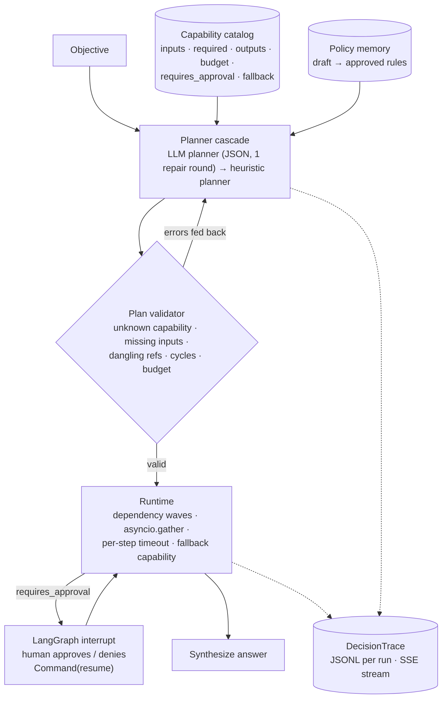

# governed-agent-orchestrator

**A capability catalog with typed contracts, a plan validator, an LLM-then-heuristic planner cascade, parallel-wave execution with fallbacks, a DecisionTrace journal, governed policy memory, and a LangGraph runtime that interrupts for human approval. Exposed over FastAPI with Server-Sent Events.**

  [](https://github.com/gandhiashutosh14/governed-agent-orchestrator/actions/workflows/ci.yml) 

---

## What it is, and why

An agent that can call tools is easy. An agent a business can trust needs a few more things: a contract for every capability it may use, a plan that is validated before anything runs, a hard stop before side effects until a human says yes, a journal of every decision, and rules that only reach the planner after review. This repository implements those pieces over a small, deterministic demo domain (a music store's sales analytics on the public Chinook database) so the behaviour of the orchestration layer can be inspected and tested without a model in the loop.

## Architecture



## Key features

- **Capability catalog as data** ([`capabilities.json`](capabilities.json)): each capability declares inputs, required inputs, outputs, a millisecond budget, whether it needs approval, and a fallback. It is rendered into the planner prompt, so adding an agent is a JSON edit.
- **Exhaustive plan validation**: unknown capabilities, missing required inputs, undeclared inputs, references to unknown steps or outputs, self-references, cycles, step and budget limits, all reported at once so the planner can fix everything in one round.
- **Planner cascade**: an LLM planner (local Hugging Face model or any OpenAI-compatible endpoint) with one repair round, falling back to a deterministic keyword planner. The trace records which planner produced the plan and whether a fallback happened.
- **Wave execution**: steps are grouped into dependency levels and each level runs concurrently; each step is bounded by its capability budget; failures try the declared fallback capability before the run is marked failed.
- **Human approval gate**: `send_report` is the only side-effecting capability and requires approval. The LangGraph node interrupts, the API reports `awaiting_approval` with the steps already completed, and `POST /runs/{id}/approve` resumes via `Command(resume=...)`. Denial ends the run cleanly.
- **DecisionTrace**: 16 event types with monotonic sequence numbers, persisted per run as JSONL and streamed as SSE (`GET /runs/{id}/events` replays history, then follows live).
- **Governed policy memory**: rules are draft by default and are only injected into the planner prompt once approved; a miner turns fallbacks and rejected plans into draft suggestions.

## Measured behaviour

Audit of the 20 objectives in [`audit/objectives.json`](audit/objectives.json) with the heuristic planner (no model), auto-approving gates, 2026-09-16 ([`reports/audit-heuristic.md`](reports/audit-heuristic.md)):

| Metric | Value |
|---|---|
| Valid plan from the first planner | 20 / 20 |
| Answered | 20 / 20 |
| Approval gates raised | 3 (the three objectives that ask to send or email a report) |
| Step fallbacks fired | 0 |
| Median latency | 9 ms |

API smoke test with uvicorn: `POST /runs` for a forecast-and-send objective returned `awaiting_approval` with steps s1..s3 already completed; the SSE endpoint replayed 12 events; `POST /runs/{id}/approve` completed the run with a linear-trend forecast in the answer; a second approve returned 409.

An audit with `Qwen/Qwen2.5-Coder-1.5B-Instruct` as the first planner was started; its first objective produced a plan the validator accepted on the first try, and a later reply with a malformed `inputs` field exposed a parser crash that is now fixed and tested. The run was stopped before completion because of GPU load on the development laptop, so no LLM-planner audit numbers are claimed here.

## Tech stack

Python 3.10+ · LangGraph (StateGraph, MemorySaver, `interrupt` / `Command`) · FastAPI + uvicorn · SQLite · optional PyTorch + Transformers for a local planner model.

## Quick start

```bash
git clone https://github.com/gandhiashutosh14/governed-agent-orchestrator.git
cd governed-agent-orchestrator
python -m venv .venv && .venv\Scripts\activate      # macOS/Linux: source .venv/bin/activate
pip install -e ".[dev]"
pytest -q                                            # 15 passed, no model needed

# One objective, auto-approving the gate
orchestrator run "Forecast next year's revenue and send it to finance@example.com." --approve

# The 20-objective audit
orchestrator audit --objectives audit/objectives.json --report reports/audit.md

# The API
orchestrator serve --port 8000
curl -X POST localhost:8000/runs -H "Content-Type: application/json" -d "{\"objective\": \"Send the top 5 countries by revenue to the sales director.\"}"
curl localhost:8000/runs/<run_id>/events            # SSE
curl -X POST localhost:8000/runs/<run_id>/approve -H "Content-Type: application/json" -d "{\"approved\": true}"

# With a model as the first planner (pip install -e ".[hf]"; or ORCH_BASE_URL + openai:<model>)
orchestrator audit --objectives audit/objectives.json --report reports/audit-llm.md --llm hf:Qwen/Qwen2.5-Coder-1.5B-Instruct
```

## Project layout

```
orchestrator/catalog.py      Capability, Catalog (load, render)
orchestrator/plan.py         Plan, parse_plan, validate_plan, execution_waves
orchestrator/planner.py      LLMPlanner, HeuristicPlanner, PlannerCascade
orchestrator/heuristics.py   the demo domain's deterministic planning rules
orchestrator/runtime.py      waves, timeouts, fallbacks, ApprovalRequired
orchestrator/graph.py        LangGraph: plan → execute (interrupt) → synthesize
orchestrator/trace.py        DecisionTrace events + JSONL
orchestrator/policy.py       PolicyMemory (draft/approved) + rule mining
orchestrator/capabilities.py demo adapters over Chinook + policy docs
orchestrator/api.py          FastAPI + SSE
orchestrator/audit.py        batch runs and report
capabilities.json · audit/objectives.json · docs/policies/*.md · reports/
docs/DEVELOPMENT_NOTES.md    how this was built, including the bugs found
```

## Status and scope

Working prototype. The demo capabilities are deterministic SQL and a linear trend; the LLM is only the planner and its plans are always validated. Checkpointing uses LangGraph's in-memory saver (swap in a SQLite or Postgres saver for persistence across processes). There is no authentication on the API.

## License

MIT. See [LICENSE](LICENSE).
