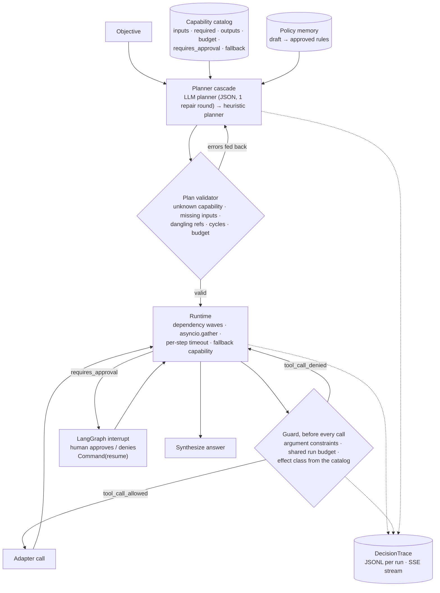

# governed-agent-orchestrator

**A capability catalog with typed contracts, a plan validator, an LLM-then-heuristic planner cascade, parallel-wave execution with fallbacks, bounded tool execution (argument constraints, a shared per-run call budget, effect classes), a DecisionTrace journal that records every allowed and denied call, governed policy memory, and a LangGraph runtime that interrupts for human approval. Exposed over FastAPI with Server-Sent Events.**

  [](https://github.com/gandhiashutosh14/governed-agent-orchestrator/actions/workflows/ci.yml) 

---

## What it is, and why

An agent that can call tools is easy. An agent a business can trust needs a few more things: a contract for every capability it may use, a plan that is validated before anything runs, a hard stop before side effects until a human says yes, a journal of every decision, and rules that only reach the planner after review. This repository implements those pieces over a small, deterministic demo domain (a music store's sales analytics on the public Chinook database) so the behaviour of the orchestration layer can be inspected and tested without a model in the loop.

## Architecture



## Key features

- **Capability catalog as data** ([`capabilities.json`](capabilities.json)): each capability declares inputs, required inputs, outputs, a millisecond budget, whether it needs approval, and a fallback. It is rendered into the planner prompt, so adding an agent is a JSON edit.
- **Exhaustive plan validation**: unknown capabilities, missing required inputs, undeclared inputs, references to unknown steps or outputs, self-references, cycles, step and budget limits, all reported at once so the planner can fix everything in one round.
- **Planner cascade**: an LLM planner (local Hugging Face model or any OpenAI-compatible endpoint) with one repair round, falling back to a deterministic keyword planner. The trace records which planner produced the plan and whether a fallback happened.
- **Wave execution**: steps are grouped into dependency levels and each level runs concurrently; each step is bounded by its capability budget; failures try the declared fallback capability before the run is marked failed.
- **Bounded tool execution** ([`orchestrator/guard.py`](orchestrator/guard.py)): before any adapter is called the runtime checks the resolved arguments against constraints declared in the catalog and reserves one unit of a call budget shared by the whole run. Both outcomes are trace events. See [Bounded tool execution](#bounded-tool-execution).
- **Human approval gate**: `send_report` is the only side-effecting capability and requires approval. The LangGraph node interrupts, the API reports `awaiting_approval` with the steps already completed, and `POST /runs/{id}/approve` resumes via `Command(resume=...)`. Denial ends the run cleanly.
- **DecisionTrace**: 19 event types with monotonic sequence numbers, persisted per run as JSONL and streamed as SSE (`GET /runs/{id}/events` replays history, then follows live).
- **Governed policy memory**: rules are draft by default and are only injected into the planner prompt once approved; a miner turns fallbacks and rejected plans into draft suggestions.

## Bounded tool execution

An agent runtime that can call tools needs to answer three questions before every call: *may this argument value be passed at all*, *has this run already spent what it was given*, and *what kind of side effect is this*. This repository answers them with data in the catalog and a check in the runtime, not with a prompt.

What is enforced, and where:

| Control | Declared in | Enforced by | Trace event |
|---|---|---|---|
| Argument constraints per input (`min`, `max`, `allowed`, `allowed_domains`, `pattern`, `max_length`) | `capabilities.json` → `constraints` | `validate_plan` for literal arguments (a bad plan never runs); `Runtime` again for arguments that resolve from earlier outputs | `plan_rejected` or `tool_call_denied` (reason `constraint`, with the violations spelled out) |
| Shared call budget per run, including fallback calls; `RunBudget.child()` scopes draw from their parent atomically, so two children of a 10-call budget cannot spend 20 between them | `--call-limit N` / `ORCH_CALL_LIMIT` / `Orchestrator(call_limit=)` | `Runtime` reserves one unit under a lock before each call; the count survives the approval interrupt | `tool_call_allowed` (with the budget snapshot), `tool_call_denied` (reason `budget`), `budget_exhausted` (once per run) |
| Effect class `reversible` / `compensable` / `irreversible` with an optional `compensation` capability | `capabilities.json` → `effect`, `compensation` | Catalog load refuses an irreversible capability that does not require approval, a compensable one without a compensation, or a compensation that is not a capability. The plan format has no such field, so a planner cannot relabel a tool | `approval_required` and `tool_call_allowed` carry the effect |

A denial is not a failure to retry: the step fails with the reason, no fallback is tried, and dependants are blocked. The catalog is loaded by the operator and rendered into the planner prompt, so the model sees the constraints but cannot change them.

Demo (deterministic heuristic planner, no model; the report says which revision produced it):

```bash
orchestrator demo-guard --report reports/guard-demo.md
```

[`reports/guard-demo.md`](reports/guard-demo.md) records three scenarios: a report to `finance@example.com` that passes the domain constraint, waits at the irreversible gate, is approved and delivered with every call journaled; the same objective addressed to `finance@evil-example.org`, rejected by the validator before any tool runs; and a scripted plan with two independent steps under a one-call budget, where exactly one sibling runs and the other is denied.

What this is not: there is no taint tracking of values, no delegation to sub-agents (the budget primitive supports child scopes and is tested that way, but the runtime has no sub-plans yet), no compensation is executed automatically (`compensation` is recorded on the trace so an operator or a later runtime can invoke it), and no prompt-injection benchmark was run. The demo proves what the reference monitor does with the arguments it is given; it says nothing about how good a planner is at choosing them.

## Measured behaviour

Audit of the 20 objectives in [`audit/objectives.json`](audit/objectives.json) with the heuristic planner (no model), auto-approving gates, 2026-09-16 ([`reports/audit-heuristic.md`](reports/audit-heuristic.md)):

| Metric | Value |
|---|---|
| Valid plan from the first planner | 19 / 20 |
| Answered | 19 / 20 |
| Approval gates raised | 2 (the objectives that ask to send or email a report to an address) |
| Step fallbacks fired | 0 |
| Median latency | 6 ms |

Before the recipient constraint was added this audit answered 20 / 20 with 3 approval gates. The objective that now fails, "Send the top 5 countries by revenue to the sales director", names no address in an allowed domain, so the validator rejects the plan instead of asking a human to approve a delivery to nobody. The objective was kept as it was so the change is visible.

API smoke test with uvicorn: `POST /runs` for a forecast-and-send objective returned `awaiting_approval` with steps s1..s3 already completed; the SSE endpoint replayed 12 events; `POST /runs/{id}/approve` completed the run with a linear-trend forecast in the answer; a second approve returned 409.

An audit with `Qwen/Qwen2.5-Coder-1.5B-Instruct` as the first planner was started; its first objective produced a plan the validator accepted on the first try, and a later reply with a malformed `inputs` field exposed a parser crash that is now fixed and tested. The run was stopped before completion because of GPU load on the development laptop, so no LLM-planner audit numbers are claimed here.

## Tech stack

Python 3.10+ · LangGraph (StateGraph, MemorySaver, `interrupt` / `Command`) · FastAPI + uvicorn · SQLite · optional PyTorch + Transformers for a local planner model.

## Quick start

```bash
git clone https://github.com/gandhiashutosh14/governed-agent-orchestrator.git
cd governed-agent-orchestrator
python -m venv .venv && .venv\Scripts\activate      # macOS/Linux: source .venv/bin/activate
pip install -e ".[dev]"
pytest -q                                            # 27 passed, no model needed

# One objective, auto-approving the gate; --call-limit caps tool calls for the whole run
orchestrator run "Forecast next year's revenue and send it to finance@example.com." --approve --call-limit 8

# The three bounded-execution scenarios (allowed, denied, budget exhausted)
orchestrator demo-guard --report reports/guard-demo.md

# The 20-objective audit
orchestrator audit --objectives audit/objectives.json --report reports/audit.md

# The API
orchestrator serve --port 8000
curl -X POST localhost:8000/runs -H "Content-Type: application/json" -d "{\"objective\": \"Send the top 5 countries by revenue to the sales director.\"}"
curl localhost:8000/runs/<run_id>/events            # SSE
curl -X POST localhost:8000/runs/<run_id>/approve -H "Content-Type: application/json" -d "{\"approved\": true}"

# With a model as the first planner (pip install -e ".[hf]"; or ORCH_BASE_URL + openai:<model>)
orchestrator audit --objectives audit/objectives.json --report reports/audit-llm.md --llm hf:Qwen/Qwen2.5-Coder-1.5B-Instruct
```

## Project layout

```
orchestrator/catalog.py      Capability, Catalog (load, render)
orchestrator/plan.py         Plan, parse_plan, validate_plan, execution_waves
orchestrator/planner.py      LLMPlanner, HeuristicPlanner, PlannerCascade
orchestrator/heuristics.py   the demo domain's deterministic planning rules
orchestrator/guard.py        argument constraints, RunBudget (shared, child scopes)
orchestrator/runtime.py      waves, timeouts, fallbacks, the guard, ApprovalRequired
orchestrator/demo.py         the three bounded-execution scenarios and their report
orchestrator/graph.py        LangGraph: plan → execute (interrupt) → synthesize
orchestrator/trace.py        DecisionTrace events + JSONL
orchestrator/policy.py       PolicyMemory (draft/approved) + rule mining
orchestrator/capabilities.py demo adapters over Chinook + policy docs
orchestrator/api.py          FastAPI + SSE
orchestrator/audit.py        batch runs and report
capabilities.json · audit/objectives.json · docs/policies/*.md · reports/
docs/DEVELOPMENT_NOTES.md    how this was built, including the bugs found
```

## Status and scope

Working prototype. The demo capabilities are deterministic SQL and a linear trend; the LLM is only the planner and its plans are always validated. Checkpointing uses LangGraph's in-memory saver (swap in a SQLite or Postgres saver for persistence across processes). There is no authentication on the API. The bounded-execution controls cover arguments, call counts and effect classes; they do not track where a value came from, do not execute compensations, and have not been evaluated against adversarial planners.

## License

MIT. See [LICENSE](LICENSE).
